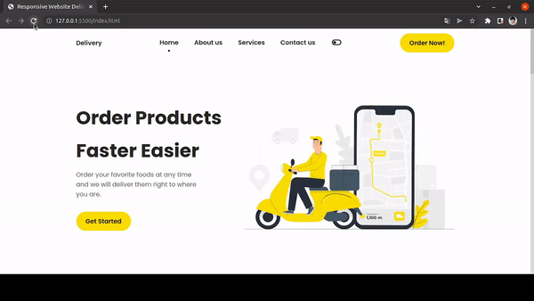

<h1 align="center">Delivery App</h1>
<h3 align="center">Landing Page, a SASS study case</h3>

In a way to keep learning and practicing Sass I decided to develop this project following <a href="https://www.youtube.com/watch?v=xOQU3YNHxJc" target="_blank">this online tutorial</a> made by Bedimcode. Through this tutorial I learned how to build the switch toggle to dark and light mode, style the scroll thumb and to color svg images.

  

<h3 align="left">Skills</h3>

- Sass
- Build my first landing page
- Responsive page
- Variables
- Manipulate svg images
- Dark and light mode

<h3 align="left">Connect with me</h3>

<h3 align="left">Languages and Tools</h3>

       

